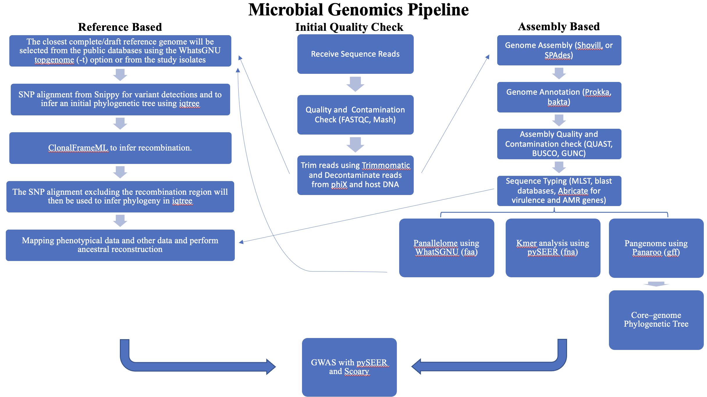

# Microbial Genomics Journey Workshop Ghana 2026
## Session 13: Graduation Project

### Teaching Evaluations
Please evaluate my teaching!<br/>
To start the survey, you may use either of the two choices (the Survey Access Code or
the QR code), whichever you find easiest or quickest to use.
1. Please access this [Survey title: "Teaching Evaluations" link](https://redcap.chop.edu/surveys/). Then enter this code: WAE4YWJYK.
2. Teaching Evaluation QR Code


Please complete the survey below as follows.
* Division of Faculty Member (GI/Nutrition/Hepatology)
* Faculty Member (Ahmed M Moustafa)
* Type of teaching (Lectures/Discussions etc.)
* Date of Teaching (select today)
* Topic of Lecture (Microbial Genomics Journey Workshop-1 week)
* Your Position (put your position)
* Quality of this instructor (choose a value)
* Comments (optional but will be appreciated)

### MGJW Chatbot and Final Feedback GH26
https://docs.google.com/forms/d/e/1FAIpQLSeYZo_5AH7ECev5HdeZ4KJ-YnLhaMBxnIC0L-INxHQz3v3EsQ/viewform?usp=publish-editor

### updated knowledge map
We started this workshop with "Map your Microbial Genomics knowledge out". Knowledge mapping helps communicate information and solve complex problems. Now it is time to update your knowledge map with what we learnt in this workshop. Here is my version. You can access a powerpoint version of this Microbial genomics knowledge map [here](Knowledge_Map_2.pptx).<br/>


---
### Description
* There will be 3 teams. Each team will work together on a project with certain comparative genomics questions to try to answer. We talked about too many tools and approaches, this project will be the most important part of the workshop as you will be able to apply what you have learnt so far and put it all together.
* You can access the dataset from `wget -O GH26.zip "https://www.dropbox.com/scl/fi/nul61uvt3plh6sgbj2t7r/GH26.zip?rlkey=ggy43gxq7ru9uzwc4a4qs6usx&st=ogwaczca&dl=0"`.
* `unzip GH26.zip -d GH26`
* There is assemblies folder with 6 genomes and 1 file showing case and control designations.
* Each team will have to present their methods, main commands and major findings.

### Thoughts and Tips
* Go through the material and you will be able to process these isolates from start to finish. You may not use all of the tools.
* The readme file on github with the syllabus has a nice summary for all steps and tools we discussed.

### Questions to answer
These 6 genomes are from a single species. There are two group of isolates (case and control). You are provided with fastq reads files and fasta files.
1. What are the differences between the genomes in the case group vs control group?
2. Build a phylogenetic tree for these genomes. Describe your findings on the tree!

### Solution

* For each file you can do abricate or prokka using a command like this

```
prokka --outdir GCA_000775375.1 --prefix GCA_000775375.1 GCA_000775375.1.fasta
abricate GCA_000775375.1.fasta > GCA_000775375.1.tab
```
* to run pangenome and a tree using the output from the pangenome step

```
roary -e -n -p 8 *.gff
iqtree2 -s core_gene_alignment.aln -m MFP -bb 1000
```

* Copy your file from the docker image, you will need to change a159a85b2eee to the docker id which next to your root after the @ sign and change location to where your file is in the docker image
```
cd C:\Users\$USER\Downloads
docker cp a159a85b2eee:/data/GH26/tree/GH26_tree.contree C:\Users\$USER\Downloads
```